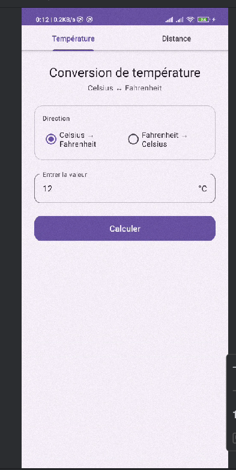
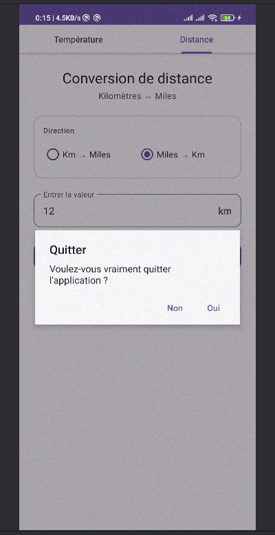

# LAB 5 — Convertisseur Temperature et Distance (Fragments + Onglets)

Une application Android avec deux onglets de conversion : temperatures (C vers F) et distances (Km vers Miles), avec menu Quitter et confirmation de fermeture.

---

## Description

Cette application Android illustre l'utilisation combinee de `TabLayout`, `ViewPager2` et des fragments a travers deux convertisseurs :

- **Onglet 1** : conversion de temperatures Celsius vers Fahrenheit et inversement
- **Onglet 2** : conversion de distances Kilometres vers Miles et inversement
- **Menu Quitter** : intercepte le bouton Retour et demande confirmation avant de fermer

---

## Objectifs du Lab

Comprendre et mettre en pratique :
- La creation d'une navigation par onglets avec `TabLayout` et `ViewPager2`
- La synchronisation des onglets avec `TabLayoutMediator`
- La creation d'un `ViewPagerAdapter` pour fournir les fragments
- La surcharge de `onBackPressed()` pour afficher une boite de dialogue de confirmation
- La separation de la logique de conversion dans des fragments independants

---

## Pre-requis

- **Android Studio**
- Minimum SDK : **API 24 (Android 7.0)**
- Connaissance de base des fragments et des layouts XML

---

## Structure du Projet

```
com.example.converttabsjava/
├── MainActivity.java
├── ViewPagerAdapter.java
├── TemperatureFragment.java
└── DistanceFragment.java

res/layout/
├── activity_main.xml
├── fragment_temperature.xml
└── fragment_distance.xml
```

---

## Dependances — `build.gradle (Module: app)`

| Dependance | Version | Role |
|---|---|---|
| `material` | 1.12.0 | fournit `TabLayout` et `AlertDialog` modernes |
| `viewpager2` | 1.0.0 | gere le defilement horizontal entre les fragments |

---

## Etape 1 — Interface Principale : `activity_main.xml`

Le layout principal contient deux composants empiles verticalement :

| Composant | Role |
|---|---|
| `TabLayout` | affiche les etiquettes des onglets en haut |
| `ViewPager2` | affiche le fragment correspondant a l'onglet selectionne |

---

## Etape 2 — Classe Principale : `MainActivity.java`

`MainActivity` initialise les trois elements cles et les relie ensemble :

| Element | Role |
|---|---|
| `TabLayout` | gere les etiquettes des onglets |
| `ViewPager2` | gere le contenu affiche selon l'onglet choisi |
| `ViewPagerAdapter` | fournit le fragment correspondant a chaque position |
| `TabLayoutMediator` | synchronise les titres des onglets avec les pages du ViewPager |
| `onBackPressed()` | affiche une boite de confirmation avant de quitter |

---

## Etape 3 — Adaptateur : `ViewPagerAdapter.java`

`ViewPagerAdapter` etend `FragmentStateAdapter` et retourne le fragment correspondant a chaque position :

| Position | Fragment |
|---|---|
| 0 | `TemperatureFragment` |
| 1 | `DistanceFragment` |

---

## Etape 4 — Fragment Temperature : `TemperatureFragment.java`

Ce fragment contient un champ de saisie, un groupe de boutons radio (C vers F / F vers C) et un bouton de conversion. La formule appliquee depend de la direction choisie :

| Conversion | Formule |
|---|---|
| Celsius vers Fahrenheit | `(C × 9/5) + 32` |
| Fahrenheit vers Celsius | `(F − 32) × 5/9` |

---

## Etape 5 — Fragment Distance : `DistanceFragment.java`

Ce fragment contient un champ de saisie, un groupe de boutons radio (Km vers Miles / Miles vers Km) et un bouton de conversion :

| Conversion | Formule |
|---|---|
| Kilometres vers Miles | `Km × 0.621371` |
| Miles vers Kilometres | `Miles ÷ 0.621371` |

---

## Comportement Attendu

| Action | Resultat |
|---|---|
| Onglet Temperature, saisir `25` (C vers F) | Affiche `77.0 °F` |
| Onglet Distance, saisir `10` (Km vers Miles) | Affiche `6.21 miles` |
| Appuyer sur Retour | Boite de dialogue "Voulez-vous vraiment quitter ?" |
| Cliquer "Oui" | Ferme l'application |
| Cliquer "Non" | Annule et reste dans l'application |

---

## Concepts Cles

- **`TabLayout`** — barre d'onglets Material Design, affiche les titres des pages
- **`ViewPager2`** — conteneur de fragments avec navigation horizontale par glissement
- **`TabLayoutMediator`** — lien entre `TabLayout` et `ViewPager2` pour synchroniser titres et pages
- **`FragmentStateAdapter`** — adaptateur qui gere la creation et la destruction des fragments selon la page visible
- **`onBackPressed()`** — methode surchargee pour intercepter le bouton Retour et ajouter une logique personnalisee
- **`AlertDialog`** — boite de dialogue native Android pour confirmer une action

---

## Lancer le Projet

1. Cloner le depot :
   ```bash
   git clone https://github.com/votre-utilisateur/convert-tabs-java.git
   ```
2. Ouvrir le projet dans **Android Studio**
3. Verifier que les dependances `material` et `viewpager2` sont bien presentes dans `build.gradle`
4. Lancer sur un emulateur ou un appareil physique (API 24+)

---

## Technologies


---

## Licence

Ce projet est realise dans le cadre d'un laboratoire pedagogique.

---

## Screenshot



